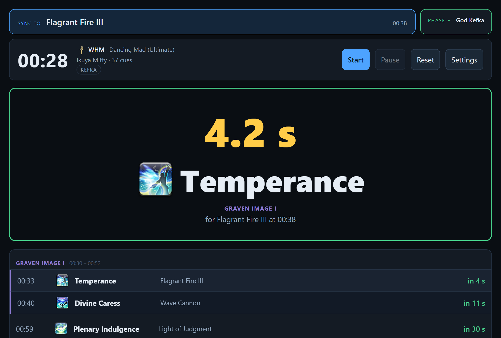
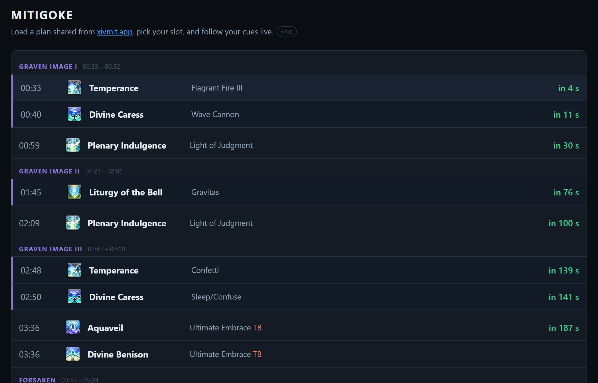
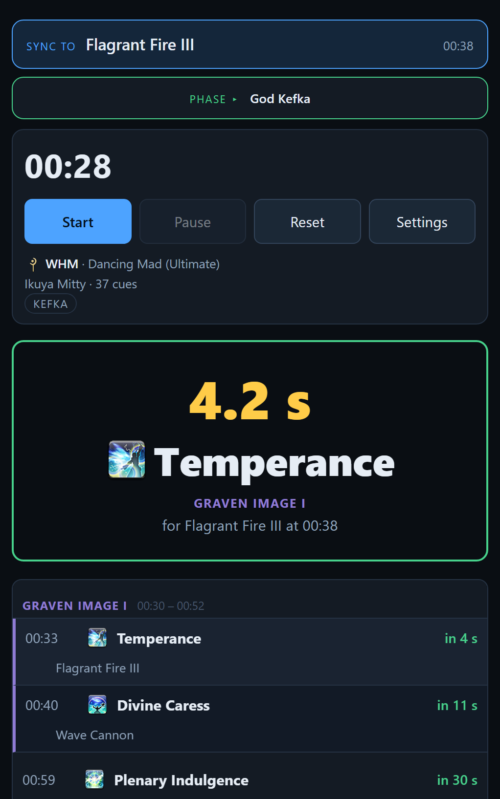

<h1 align="center">Mitigoke</h1>

<p align="center">
  <b>Your mitigation plan, called out one cue at a time.</b><br>
  A live prompter for Final Fantasy XIV raid mitigation — built for Ultimate progression.
</p>

<p align="center">
  <a href="https://ffxivmitigoke.spinecho.fr"><b>ffxivmitigoke.spinecho.fr</b></a>
  &nbsp;·&nbsp; free &nbsp;·&nbsp; no account &nbsp;·&nbsp; nothing to install
</p>



---

## The problem

A mitigation plan is a spreadsheet. Someone spends hours getting it right — who presses
what, and when, down to the second — and then, in the middle of a pull, nobody can read it.
You are watching the boss, not a table of thirty rows in which four of them are yours.

**Mitigoke turns that plan into a prompter.** It loads the plan your group already shares
on [xivmit.app](https://xivmit.app), you pick your slot, and from that moment you see
*only your own* cooldowns — announced a few seconds ahead, with a countdown, the boss cast
they answer, and a beep so you do not have to watch the screen at all.

## Getting started

1. Build or open your plan on **[xivmit.app](https://xivmit.app)** and copy its share link.
2. Paste it into [ffxivmitigoke.spinecho.fr](https://ffxivmitigoke.spinecho.fr) — the plan
   code on its own works too.
3. Pick your slot, press **Open prompter**, then **Start** on the pull.

One link is all a group needs:

```
https://ffxivmitigoke.spinecho.fr/?plan=UMAD-G0FF1B
```

Everyone opens it and chooses their own slot. Nobody signs up for anything.

---

## What it does

### Only your cooldowns, a few seconds early

The big panel shows one thing: what *you* press next, how long until you press it, and
which boss cast it is answering. The lead time is yours to set. Two quiet warning beeps at
two seconds and one second, then a louder one when it is time — so the prompter works even
on a second screen you are not looking at.

### Staying on the boss

This is the part that makes a prompter usable in a real pull.

A plan is a single timeline anchored at the pull, but a phase ends when your group kills
it. Kill it thirty seconds early and every cue after that is thirty seconds late. So there
are two buttons above the clock, each naming what it will snap to:

- **Sync to &lt;cast&gt;** — the fine adjustment. Press it the moment the boss does the
  thing named on the button, and the whole timeline slides onto that instant. A phase
  change is invisible on screen; a boss cast is something you *see*, which is what makes
  this the reliable one.
- **Phase ▸ &lt;name&gt;** — the coarse adjustment, for the moment a phase actually turns.

The clock lands half a second *after* the event, not on it: by the time your finger reaches
the button, the cast has already begun.

### The whole plan, grouped the way a raid calls it

The queue holds every cue in the plan, not a sliding window, so you can read the fight
through before the pull. Consecutive cues belonging to the same boss mechanic are framed
together under its name.



### One clock for the whole party

One person names the party and gets a link. Everyone who opens it follows their clock:
their **Start** starts everyone, their pause pauses everyone, and their resyncs move
everyone. Each player still sees only their own cues, and can nudge their own display
without affecting anyone else.

Two clients measured **0.3 ms apart** in production. Nothing is stored about anybody — no
account, no name, no address.

### On a phone

The same page, in one column, with thumb-sized controls.

<p align="center">
  
</p>

### And when the internet is not your friend

A plan can be exported to a file and reloaded later, so a group can run entirely from local
copies. Ability names come in **English, French, German and Japanese**.

---

## Credits

Plans, fights and the ability catalogue all come from **[xivmit.app](https://xivmit.app)**,
built by **liam_galt** — you can support him on [ko-fi](https://ko-fi.com/liam_galt).
Mitigoke is a viewer and nothing more: without his work there is no plan to play back. He
was asked before any of this went out, and he agreed.

His API is public but neither documented nor contractual, and may change without notice.

FINAL FANTASY XIV and all associated imagery are the property of **Square Enix Co., Ltd.**
This project is unofficial, unaffiliated and not endorsed by Square Enix.

---
---

# Technical

Everything below is for people who want to run it, read it, or take it apart.

## Design, in five decisions

**No build step, no dependencies, no package manager.** The prompter is one HTML file with
its CSS and JavaScript inside it. You edit it, you copy it to a server, it is live. The one
concession is a comment stripper run at deploy time, which shaves 26 % off the page —
`index.html` in this repository is the commented source, and it is what you should read.

**The clock is recomputed, never incremented.** `setInterval` at 10 Hz, and every pass
derives the fight time from `performance.now()`. `requestAnimationFrame` is deliberately
not used: it is suspended the moment the window stops being composited, which is exactly
the case of a prompter on a second screen. If the browser throttles the loop the display
stalls, but the clock never drifts.

**Beeps are scheduled ahead on the audio clock.** A background tab has its timers throttled
to once a second, then once a minute. The audio thread is not throttled, so upcoming beeps
are scheduled as absolute times on the `AudioContext` — measured 1 ms off target with the
JavaScript thread deliberately blocked for 900 ms.

**A party room stores an instant, not a running clock.** It holds `t0`, the *server* moment
at which the fight reaches 00:00. Each client derives its own position and then runs
independently, so a group synchronises once per pull rather than continuously.

**Client clocks are never trusted.** Two machines can be seconds apart. Every response
carries the server time; the client probes three times, keeps the shortest round trip, and
anchors to `performance.now()` — monotonic — rather than `Date.now()`, which the operating
system can step mid-session. Clients only ever send a *delay*; the server dates the start.

## Requirements

- Any static host with **PHP 8.1** and `curl`. No database, no cron, no websocket.
- The web root must be writable: the scripts create `.cache/` and `.sync/` on first use.

## Install

Copy the contents of this directory to your web root, then open
`https://your-host/?plan=SOME-CODE`. The bundled `.htaccess` sets the security headers and
blocks the service directories.

### Endpoints

```
api.php?plan=UMAD-G0FF1B    the shared plan        (cached 300 s, 3600 s if popular)
api.php?plan=CODE&refresh=1 the same, re-read from upstream
api.php?fight=umad          the fight              (cached 86400 s)
api.php?abilities=1         the ability catalogue  (cached 86400 s)

sync.php?now=1              server time (calibration probe)
sync.php?room=ID            room state
POST sync.php               {action: create|state|hello}
```

`api.php` exists because the upstream API sends no CORS headers, so the browser cannot call
it directly. It has fixed actions and no free-form path: **no arbitrary URL can be
requested through it.** Responses are cached on disk to spare the upstream server, a stale
cache is served rather than an error if upstream is unreachable, and the busiest plans get
an hour of cache instead of five minutes.

`mapping.json` carries the display name in four languages, an icon path, a duration and a
mitigation percentage for each of the 158 abilities. The repository also ships two editing
tools that are not part of the prompter; the one that writes this table must be put behind
a password before the site is reachable by strangers.

## Before you expose this publicly

- **Password-protect the admin directory.** Everything that writes lives there. Two further
  locks are in place and neither replaces a password: a write token, and a refusal of
  cross-origin writes — that last one matters *because* of the password, since an
  authenticated browser attaches its credentials by itself.
- **A shared plan file is untrusted input.** Its optional `abilities` block can redefine any
  icon; a path pointing at a third-party server would make every player's browser call it.
  Icon paths from a plan file are filtered on load, and the Content-Security-Policy blocks
  it a second time in the browser.
- Room creation is rate-limited per requester on top of a global cap. The address is hashed
  with the hour, so it counts without keeping a log.

## Known limitations

- **Background tabs.** Browsers throttle timers to about 1 Hz in a hidden tab, and to once a
  minute after five. The clock stays exact and the beeps stay on time; the *display* lags,
  and that is left alone — a window you cannot see is a window you are not reading.
- Party sync has been verified between two clients, not yet across a full group of eight.
- Eight generic entries carry only per-job icons, so a slot typed by *role* rather than by
  job shows the ability name without artwork.
- `mapping.json` can be edited live, so a deployed copy may drift from the one here.

## Version history

**1.0** — resync on a boss cast, the feature that makes the rest usable in a real pull;
both resync buttons moved above the clock and now name their target; the site went public
and indexable, with the write endpoints moved behind a password.

**0.0.6** — one shared plan format between the prompter and the plan editor, which had
drifted apart on nine points; a lost party room is now reported instead of polling into the
void; beeps scheduled on the audio clock so they survive a background tab.

**0.0.5** — phase snapping; an hour of cache for the busiest plans, with a refresh control.

**0.0.4** — chained cooldowns shown together; the leader sees which slots have the plan
open; per-job icons for generic entries.

**0.0.3** — plan export; warning beeps at two and one seconds; still-running effects kept
on screen with their remaining time.

**0.0.2** — the full queue grouped by mechanic; phone layout; offline plan files.

**0.0.1** — first working prompter, with icons, localised names and party sync.

## Licence

MIT, for the code — see [LICENSE](LICENSE). Game assets included in this repository remain
the copyright of Square Enix and are not covered by it.
